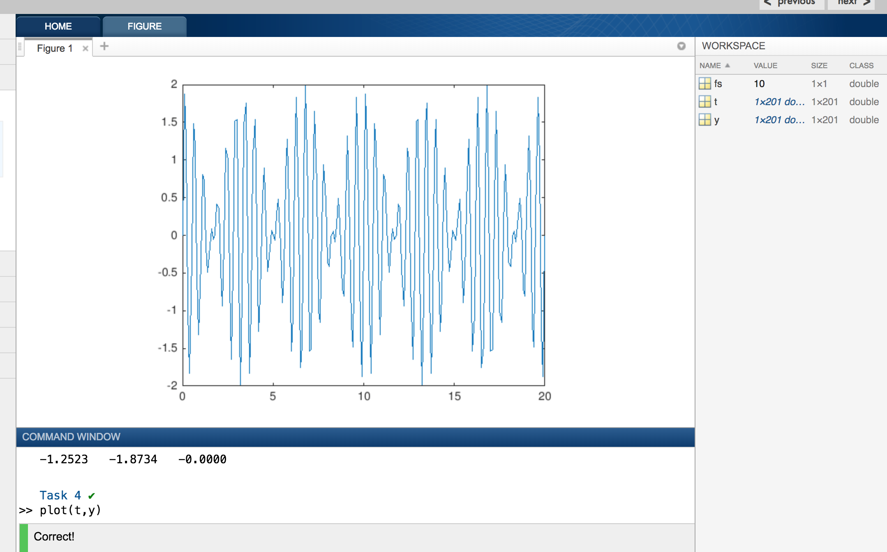

# MATLAB
MATLAB Tutorial

This tutorial is for beginners who wants to learn MATLAB. Let's begin with commands.

#### Course Contents

This course describes about the following topics.

1. Course Overview
  Familiarize yourself with the course.
    - Course Overview
2. Commands
  Enter commands in MATLAB to perform calculations and create variables.
    - Entering Commands
    - Storing Data in Variables
    - Using Built-in Functions and Constants
    - Desktop Overview
3. Vectors and Matrices
  Create MATLAB variables that contain multiple elements.
    - Manually Entering Arrays
    - Creating Evenly-Spaced Vectors
    - Array Creation Functions
4. Importing Data
  Bring data from external files into MATLAB.
    - Saving and Loading Variables
    - Import Tool
5. Indexing into and Modifying Arrays
  Use indexing to extract and modify rows, columns, and elements of MATLAB arrays.
    - Indexing into Arrays
    - Extracting Multiple Elements
    - Changing Values in Arrays
6. Array Calculations
  Perform calculations on entire arrays at once.
    - Performing Array Operations on Vectors
7. Calling Functions
  Call functions to obtain multiple outputs.
    - Obtaining Multiple Outputs from Function Calls
8. Obtaining Help
  Use the MATLAB documentation to discover information about MATLAB features.
    - Obtaining Help
9. Plotting Data
  Visualize variables using MATLAB's plotting functions.
    - Plotting Vectors
    - Annotating Plots
    - Plots Tab
10. Review Problems
  Bring together concepts that you have learned with a project.
    - Project - Electricity Usage
    - Project - Audio Frequency
11. MATLAB Scripts
  Write and save your own MATLAB programs.
    - The MATLAB Editor
12. Logical Arrays
  Use logical expressions to help you to extract elements of interest from MATLAB arrays.
    - Logical Operations and Variables
    - Combining Logical Conditions
    - Logical Indexing
13. Programming
  Write programs that execute code based upon some condition.
    - Decision Branching
    - For Loops
14. Final Project
  Bring together concepts that you have learned with a project.
    - Project - Stellar Motion
    - Project - Stellar Motion (Script)

### What is MATLAB ..?
MATLAB (matrix laboratory) is a multi-paradigm numerical computing environment and proprietary programming language developed by MathWorks. ... Although MATLAB is intended primarily for numerical computing,

#### Download & Installation:

Download the latest MATLAB from [Download MATLAB](https://in.mathworks.com/downloads/web_downloads) and install it as per your operating system. To get free trail for limited days, please register with your email in MATLAB website.

### Course Overview

This explains about MATLAB.

### Entering Commands

- You can execute commands by entering them in the command window after the MATLAB prompt (>>) and pressing the Enter key.
- Unless otherwise specified, MATLAB stores calculations in a variable named **ans**.
- The equals sign (=) in MATLAB is the assignment operator, meaning that the expression on the right of the equals sign is assigned to the variable on the left. So, when you enter x = 3+4, MATLAB first evaluates 3+4 and then assigns the result (7) to the variable x.
- Notice that the Workspace window (on the right) shows all the variables currently in the workspace.
- Adding a semicolon to the end of a command will suppress the output, though the command will still be executed, as you can see in the Workspace. When you enter a command without a semicolon at the end, MATLAB displays the result in the command window.
- You can recall previous commands by pressing the Up arrow key on your keyboard. Note that the Command Window must be the active window for this to work.
- When you enter just a variable name at the command prompt, MATLAB returns the current value of that variable.

##### Storing Data in Variables
- You can name your MATLAB variables anything you'd like as long as they start with a letter and contain only letters, numbers, and underscores **_**.

        3sq = 9
          ↑
        Error: Invalid expression. Check for missing multiplication operator, missing or unbalanced delimiters, or other      
        syntax error. To construct matrices, use brackets instead of parentheses.

        Did you mean: sq = 9 ?

- Try clearing all variables by entering the command **clear**
- **clear** command removes workspace variables, and **clc** clears the Command Window.

##### Using Built-in Functions and Constants
- Info: MATLAB contains built-in constants, such as pi to represent π.
      a = pi
      a =
      3.1416

Also, although only four decimal places are shown for π, it is represented internally with greater precision.
      x = pi/2
      1.5708

- MATLAB contains a wide variety of built-in functions, such as abs (absolute value) and eig (calculate eigenvalues).

      a = sin(-5)
      a =
      0.9589

      another example
      x = sin(10)

Note that MATLAB uses parentheses to pass inputs to functions, similar to standard mathematical notation.

- Now try using the **sqrt** function to calculate the square root of -9. Assign the result to a variable named z.

      z = sqrt(-9)
      z=
      0.0000 + 3.0000i

- Note that the solution contains the imaginary number, i, which is a built-in constant in MATLAB.

You can now move to the next section, or, if you are interested, explore a sampling of some of the other built-in functions in MATLAB (linked below).
      [Elementary math](http://www.mathworks.com/help/matlab/elementary-math.html)
      [Descriptive statistics](http://www.mathworks.com/help/matlab/descriptive-statistics.html)
      [Linear algebra](http://www.mathworks.com/help/matlab/linear-algebra.html)

### Vectors and Matrices

#### Manually Entering Arrays

- All MATLAB variables are arrays, meaning that each variable can contain multiple elements. A single number, called a scalar, is actually a 1-by-1 array, meaning it contains 1 row and 1 column.

Create a variable named x with a value of 4.

      x=4
      x=
      4
- You can create arrays with multiple elements using square brackets.

      >> x = [3 5]
      x =
          3    5

Create an array named x with two elements in a single row: 7 and 9

      >> x = [7 9]
      x =
      7 9

- When you separate numbers by spaces (or commas), MATLAB combines the numbers into a row vector, which is an array with one row and multiple columns (1-by-n). When you separate them by semicolons, MATLAB creates a column vector (n-by-1)

      >> x = [1;3].

Now create an array named x with two elements, 7 and 9, in a single column. Try recalling the previous command and changing the space between the numbers to a semicolon (;).

      >> x [7;9]
      x =
       7
       9

- Now try creating a 1-by-3 row vector named x that contains the values 3, 10, and 5 in that order.

       >> x = [3 10 5]
        x =
        3  10  5

- Now try creating a 3-by-1 column vector named x that contains the values 8, 2, and -4 in that order.

        >> x = [8;2;-4]
        x =
          8
          2
          -4

- You can combine spaces and semicolons to create matrices, which are arrays with multiple rows and columns. When entering matrices, you must enter them row by row.

        >> x = [3 4 5;6 7 8]
        x =
            3    4    5
            6    7    8

Try creating a matrix named x with the values shown below.

            5    6    7
            8    9   10

          >>x = [5 6 7;8 9 10]
          x =
            5    6    7
            8    9   10

- In MATLAB, you can perform calculations within the square brackets.

        >> x = [abs(-4) 4^2]
        x =
             4    16

Try creating a 1-by-2 row vector named x that contains **sqrt(10)** as its first element and **pi^2 (π2)** as its second element.

        >> x = [sqrt(10) pi^2]
          x =
          3.1623 9.8696

#### Creating Evenly-Spaced Vectors

- It is common to create vectors containing evenly spaced numbers, such as the vector below.

        >> y = [5 6 7 8]
        y =
            5    6    7    8

Try creating a row vector named x that contains the values 1, 2, and 3, in that order.

        >> x = [1 2 3]
          x =
          1  2  3

- For long vectors, entering individual numbers is not practical. An alternative, shorthand method for creating evenly spaced vectors is to use the **:** operator and specify only the start and end points: **first:last**.

        >> y = 5:8
        y =
            5    6    7    8

Try recreating the row vector named x (still with values 1, 2, and 3), but this time using the : operator.

       >> x = 1:3
       x =
          1  2  3

- The **:** operator uses a default spacing of 1, however you can specify your own spacing, as shown below.

      >> x = 20:2:26
      x =
          20    22    24    26

Try creating a row vector named x that starts at 1, ends at 5, and each element is separated by 0.5.

      >> x = 1:0.5:5
      x =
      1.0000  1.5000  2.0000  2.5000  3.0000  3.5000  4.0000  4.5000  5.0000

An Another Example

      >> x = 3:2:13
      x =
      3 5 7 9 11 13

- If you know the number of elements you want in a vector (instead of the spacing between each element), you could instead use the linspace function: linspace(first,last,number_of_elements). Note the use of commas (,) to separate inputs to the linspace function.

      >> x = linspace(0,1,5)
      x =
          0    0.250    0.500    0.750    1.000

Try creating a row vector named x that starts at 1, ends at 10, and contains 5 elements.

      >> x = linspace(1,10,5)
      x =
           1.0000    3.2500    5.5000    7.7500   10.0000

- Both linspace and the : operator create row vectors. However, you can convert a row vector into a column vector using the transpose operator (').

      >> x = 1:3;
      >> x = x'
      x =
          1
          2
          3

Transpose x from a row vector to a column vector using the transpose operator.

      >> x =
           1.0000    3.2500    5.5000    7.7500   10.0000
      >> x = x'
      x =
        1.0000    
        3.2500    
        5.5000    
        7.7500   
        10.0000

- You can create column vectors in a single command by creating the row vector and transposing it all on one line. Note the use of parentheses here to specify the order of operations.

      >> x = (1:2:5)'
      x =
          1
          3
          5

In a single command, create a column vector named x that starts at 5, ends at 9 and has elements that are spaced by 2.

      >> x = (5:2:9)'
      x =
          5
          7
          9

#### Array Creation Functions

- MATLAB contains many functions that help you to create commonly used matrices, such as matrices of random numbers.

      >> x = rand(2)
      x =
          0.8147    0.1270
          0.9058    0.9134

Note that the 2 in the command rand(2) specifies that the output will be a 2-by-2 matrix of random numbers.
Try creating a variable named x that is a 5-by-5 matrix of random numbers.

      >> x = rand(5)
      x =
          0.8147    0.0975    0.1576    0.1419    0.6557
          0.9058    0.2785    0.9706    0.4218    0.0357
          0.1270    0.5469    0.9572    0.9157    0.8491
          0.9134    0.9575    0.4854    0.7922    0.9340
          0.6324    0.9649    0.8003    0.9595    0.6787

- Many matrix creation functions allow you to input one number to create a square matrix (n-by-n) or input two numbers to create nonsquare matrices.
      >> x = rand(2)
      x =
          0.8147    0.1270
          0.9058    0.9134    >> x = rand(2,3)
      x =
          0.6324    0.2785    0.9575
          0.0975    0.5469    0.9649

Try using rand to create an array that contains 5 rows and 1 column. Assign the result to a variable named x.

      >>x = rand(5,1)
      x =
          0.7577
          0.7431
          0.3922
          0.6555
          0.1712

- Now try using the zeros function to create a matrix of all zeros that has 6 rows and 3 columns (6-by-3). Assign the result to a variable named x.

      >> x = zeros(6,3)
      x =
           0     0     0
           0     0     0
           0     0     0
           0     0     0
           0     0     0
           0     0     0

### 4. Importing Data

#### 4.1 Saving and Loading Variables

-You can save variables in your workspace to a MATLAB specific file format called a MAT-file using the save command.

      >> save foo x

The command above saves a variable named **x** to a MAT-file named **foo.mat**.
Try saving the workspace variable **data** to a file named **datafile.mat**

      >> save  datafile data

- Now, use **clear** to empty the workspace.

      >> clear

- You can load variables from a MAT-file using the load command.

      >> load foo

Try loading the variables from the file datafile.mat.

      >> load  datafile

#### 4.2 Import Tool

- You can import the text file, image data, spreadsheet in to MATLAB.
Once you import the file, the data of the file will be saved to a variable of that file name.

You can refer to the image here.

The text file with name elements.txt is imported as singular matrix. So, you can see the variable named as **elements** in workspace.

If any empty data will be replaces as NaN -> not a number

### 5. Indexing into and Modifying Arrays

#### 5.1 Indexing into Arrays

- You can extract values from an array using row, column indexing.

      >> x = A(5,7);

This syntax extracts the value in the 5th row and 7th column of A and assigns the result to the variable x.

The **data** variable contains the following content.

      >> data
      data =
          3.0000    0.5300    4.0753       NaN
         18.0000    1.7800    6.6678    2.1328
         19.0000    0.8600    1.5177    3.6852
         20.0000    1.6000    3.6375    8.5389
         21.0000    3.0000    4.7243   10.1570
         23.0000    6.1100    9.0698    2.8739
         38.0000    2.5400    5.3002    4.4508

Now, Try creating a variable v that contains the value in the 6th row and 3rd column of the variable **data**.

      >> v= data(6,3)
      v =
      9.0698

- You can use the MATLAB keyword end as either a row or column index to reference the last element.

      >> x = A(end,2);

Now try using the end keyword to obtain the value in the last row and 3rd column of the variable data. Assign this value to a variable named v.

      >> v = data(end,3);
      v =
          5.3002

- Note that you can use arithmetic with the keyword end. For example:

      >> x = A(end-1,end-2)

Try creating a scalar variable p that contains the value in the second to last (end-1) row and 3rd column of data.

      >> p = data(end-1,3)
      p =
          9.0698

#### 5.2 Extracting Multiple Elements

- When used as an index, the colon operator (:) specifies all the elements in that dimension. The syntax

      >> x = A(2,:)

creates a row vector containing all of the elements from the second row of A.
Try creating a variable named density that contains the second column of the matrix named data.

      >> density = data(:,2)
      density =
          0.5300
          1.7800
          0.8600
          1.6000
          3.0000
          6.1100
          2.5400

- The colon operator can refer to a range of values. The following syntax creates a matrix containing the first, second, and third rows of the matrix A.

      >> x = A(1:3,:)

Try creating a variable **volumes** containing the last two columns of data.

      >> volumes = data(:,3:4)
      volumes =
          4.0753       NaN
          6.6678    2.1328
          1.5177    3.6852
          3.6375    8.5389
          4.7243   10.1570
          9.0698    2.8739
          5.3002    4.4508

- A single index value can be used to reference vector elements. For example

      >> x = v(3)

returns the third element of vector v when v is either a row or column vector.
Using a single index value, create a variable named p containing the 6th element in the vector density.

      >> p = density(6)
      p =
          6.1100

- A single range of index values can be used to reference a subset of vector elements. For example

      >> x = v(3:end)

returns a subset of vector v containing the elements from 3 to the end.
Using a range of index values, create a vector named p containing the 2nd through 5th elements of density.

      >> p = density(2:5)
      p =
          1.7800
          0.8600
          1.6000
          3.0000

#### 5.3 Changing Values in Arrays

- Remember you can use the : character to extract entire columns of data.
Create a vector named v2 containing the last column of data.

      >> v2= data(:,end)
      v2 =
             NaN
          2.1328
          3.6852
          8.5389
         10.1570
          2.8739
          4.4508

- Elements of a variable can be altered by combining indexing with assignment.

        A(2,5) = 11

Try changing the first element in v2 from NaN to 0.5.

        >> v2(1) = 0.5
        v2 =
            0.5000
            2.1328
            3.6852
            8.5389
           10.1570
            2.8739
            4.4508

- Now, try changing the value in the first row and last column of data to 0.5.

      >> data(1,end) = 0.5
      data =
          3.0000    0.5300    4.0753    0.5000
         18.0000    1.7800    6.6678    2.1328
         19.0000    0.8600    1.5177    3.6852
         20.0000    1.6000    3.6375    8.5389
         21.0000    3.0000    4.7243   10.1570
         23.0000    6.1100    9.0698    2.8739
         38.0000    2.5400    5.3002    4.4508

### 6. Array Calculations

#### 6.1 Performing Array Operations on Vectors

- MATLAB is designed to work naturally with arrays. For example, you can add a scalar value to all the elements of an array.

        >> y = x + 2

Try adding 1 to each element of v1 and store the result in a variable named r.

        >> r = v1+1\
        r =
            5.0753
            7.6678
            2.5177
            4.6375
            5.7243
           10.0698
            6.3002

- You can add together any two arrays of the same size.

        >> z = x + y

Try creating a vector vs that is the sum of the vectors v1 and v2.

        >> vs = v1+ v2
        vs =
            4.5753
            8.8006
            5.2029
           12.1764
           14.8813
           11.9437
            9.7510

- You can multiply or divide all of the elements of an array by a scalar.

        >> z = 2*x
        >> y = x/3

Try creating a variable **va** that contains the value vs divided by 2 (the average volume).

        >> va = vs/2
        va =
            2.2877
            4.4003
            2.6014
            6.0882
            7.4406
            5.9718
            4.8755

- Basic statistical functions in MATLAB can be applied to a vector to produce a single output. The maximum value of a vector can be determined using the max function.

        >> xMax = max(x)

Try creating a variable vm containing the maximum of the va vector.

        >> vm =  max(va)
        vm =
            7.4406

- MATLAB has functions that perform mathematical operations on an entire vector or array of values in a single command.

        >> xSqrt = sqrt(x)

Using the round function, create a variable named vr which contains the rounded average volumes, va.

        >> vr = round(va)
        vr =
             2
             4
             3
             6
             7
             6
             5

- The * operator performs matrix multiplication. So, if you use * to multiply two equally sized vectors, since the inner dimensions do not agree, you will get an error message.

        >> z = [3 4] * [10 20]
        Error using  *
        Inner matrix dimensions must agree.

In contrast, the **.*** operator performs elementwise multiplication and allows you to multiply the corresponding elements of two equally sized arrays.

        >> z = [3 4] .* [10 20]
        z =
            30    80

Try to create a variable named mass containing the elementwise product of density and va.

        >> mass = density .* va
        mass =
            1.2125
            7.8325
            2.2372
            9.7411
           22.3220
           36.4880
           12.3838

### 7. Calling Functions

#### 7.1 Obtaining Multiple Outputs from Function Calls

- The size function can be applied to an array to produce a single output variable containing the array size.

        >> s = size(x)

Try creating a variable named **dsize** containing the size of the data variable.

        >> dsize = size(data)
        dsize =
             7     4

- The size function can be applied to a matrix to produce either a single output variable or two output variables. Use square brackets ([ ]) to obtain more than one output.

        >> [xrow,xcol] = size(x)

Try creating the variables dr and dc which respectively contain the number of rows and columns of the variable data.

        >> [dr,dc] = size(data)
        dr =
             7
        dc =
             4

- The maximum value of a vector and its corresponding index value can be determined using the max function. The first output from the max function is the maximum value of the input vector. When called with two outputs, the second output is the index value.

        >> [xMax,idx] = max(x)

Try creating the variables vMax and ivMax containing the maximum value of the v2 vector and the corresponding index value respectively.

        >> [vMax,ivMax] = max(v2)
        vMax =
           10.1570
        ivMax =
             5

### 8. Obtaining Help

#### 8.1 Obtaining Help:  (1/2) Using MATLAB's Documentation

- You can get help for all the functions and commands from MATLAB documentation page.

#### 8.1 Obtaining Help:  (2/2) Practice

- You can enter below command to get information on any MATLAB function.

        >> doc fcnName

Enter the command doc randi to open the documentation page for the randi function. This will open the documentation page in a new browser tab.

        >> doc randi

Refer to below image how this command works.

- The MATLAB documentation contains a lot of good examples and information that can help you when working on your own problems.
Use the documentation for randi to help complete the task below.

Create a matrix named x that
    - Contains random integers in the range from 1 to 20
    - Has 5 rows
    - Has 7 columns

        >> x = randi([1,20],5,7)
        x =
            14     5     5     2     1     1    18
             3     1    15    18    20    18    19
            20     8     8    20     7    14     1
            10     5     4    19    15    16     2
            18    17    15     9     8    12     5

### 9. Plotting Data

#### 9.1 Plotting Vectors

- Two vectors of the same length can be plotted against each other using the plot function.

        >> plot(x,y)

Try creating a plot with sample on the x-axis and mass1 on the y-axis.

        >> plot(sample,mass1)  This outputs the below plot.

- The plot function accepts an additional argument that allows you to specify the color, line style, and marker style using different symbols in single quotes.

        >> plot(x,y,'r--o')

The command above plots a red (r) dashed (--) line with a circle (o) as a marker. You can learn more about the symbols available in the documentation for [Line Specification](https://in.mathworks.com/help/matlab/ref/linespec.html).
Try plotting mass2 (y-axis) against sample (x-axis). Use red (r) star (*) markers and no line in your plot.

        >> plot(sample, mass2,'r*') This outputs the below plot.

- Notice that the first plot you created no longer exists. To plot one line on top of another, use the **hold on** command to hold the previous plot while you add another line. You can also use the **hold off** command to return to the default behavior.
Issue the **hold on** command.

- Now, plot mass1 (y-axis) against sample (x-axis) with black (k) square (s) markers and no line. [Line specification options](http://www.mathworks.com/help/matlab/ref/linespec.html)

        >> plot(sample,mass1,'ks') This outputs the below plot.
]

- Try closing all open figure windows by issuing the close all command.

        >> close all

- When you plot a single vector by itself, MATLAB uses the vector values as the y-axis data and sets the x-axis data to range from 1 to n (the number of elements in the vector).
Plot the vector v1 using the command below.

        >> plot(v1)
        This outputs the following plot

- The plot function accepts optional additional inputs consisting of a property name and an associated value.

        >> plot(y,'LineWidth',5)

The command above plots a heavy line. You can learn more about available properties in the documentation for Lineseries Properties. Now try plotting v1 with a line width of 3.

        >> plot(v1,'LineWidth',3)
        This outputs the following plot

- The plot function accepts a property name and property value pair after the plotted arguments and line specifier.

        >> plot(x,y,'ro-','LineWidth',5)

Try plotting v1 (y-axis) against sample (x-axis) with red (r) circle (o) markers with a line width of 4.

        >> plot(sample,v1,'ro','LineWidth',4)
        This outputs the following plot

Further resources:
- [Line Specifiers](http://www.mathworks.com/help/matlab/ref/linespec.html)
- [Plotting Functions](http://www.mathworks.com/help/matlab/creating_plots/using-high-level-plotting-functions.html)
- [Plots](http://www.mathworks.com/help/matlab/learn_matlab/plots.html)

#### 9.2 Annotating Plots

- Labels can be added to plots using plot annotation functions, such as title. The input to these functions is a string. Strings in MATLAB are enclosed in single quotes (').

        >> title('Plot Title')

Try adding the title 'Sample Densities' to the existing plot.

        >> title('Sample Densities')

- Use the ylabel function to add the label 'Density (g/cm^3)'.

        >> ylabel('Density (g/cm^3)')

This outputs the following plot and observe plot title also in below image.
        

use **xlabel()** function to label the X axis.

        >> xlabel('Distance')

#### 9.3 Plots Tab

- Select the variables you want to plot and then go to plots tab and select the plot type you want to generate. That's all.
It generates the plot for selected variables.

### 10. Review Problems

#### 10.1 Project - Electricity Usage

- Electricity data is stored in a file named electricity.mat. Use load to bring that data into MATLAB.

      >> load electricity.mat

- Enter usage at the command prompt to see the values in usage.

      >> usage

-  In MATLAB, NaN (or, "Not a Number") is used to represent missing data.
One of the elements in the **usage** variable has a value of NaN. Replace this value with the value 2.74.

      >> usage
      usage =
          3.0484    2.5848    2.6408
          2.8610    2.5530    **NaN**
          3.2602    2.7084    2.7345
          3.3420    2.8097    2.8019
          3.3555    2.9167    2.7960
          3.4234    2.9299    2.8579
          3.5268    3.1561    2.8597
          3.9185    3.3057    2.8757
          3.9718    3.4761    2.9984
          3.8540    3.4748    2.8998
          3.8934    3.5968    2.6826
          4.3127    3.7088    2.8427
          4.2153    3.7172    2.8301
          4.1711    3.7257    2.8542
          4.6605    3.9367    2.8512
          4.7528    4.0497    2.8671
          4.4847    3.9975    2.8715
          4.6216    4.1299    2.8487
          4.4413    3.9229    2.5176
          4.9899    4.1266    2.7653
          4.9913    4.1311    2.8143
          4.9864    4.1463    2.8135
          4.6270    4.1205    2.7001

Replacing NaN with given value. The position of NaN is 2nd row and 3rd column.

    >> usage(2,3) = 2.74

- The residential data is stored in the first column. Create a variable **res** that contains the first column of **usage**.

      >> res = usage(;,1)
      res =
          3.0484
          2.8610
          3.2602
          3.3420
          3.3555
          3.4234
          3.5268
          3.9185
          3.9718
          3.8540
          3.8934
          4.3127
          4.2153
          4.1711
          4.6605
          4.7528
          4.4847
          4.6216
          4.4413
          4.9899
          4.9913
          4.9864
          4.6270

- The commercial data is stored in the second column. Create a variable **comm** that contains the second column of **usage**.

          >> comm = usage(:,2)
          comm =
              2.5848
              2.5530
              2.7084
              2.8097
              2.9167
              2.9299
              3.1561
              3.3057
              3.4761
              3.4748
              3.5968
              3.7088
              3.7172
              3.7257
              3.9367
              4.0497
              3.9975
              4.1299
              3.9229
              4.1266
              4.1311
              4.1463
              4.1205

- The industrial data is stored in the third column. Create a variable ind that contains the third column of usage.

            >> ind = usage(:,3)
            ind =
                2.6408
                2.7400
                2.7345
                2.8019
                2.7960
                2.8579
                2.8597
                2.8757
                2.9984
                2.8998
                2.6826
                2.8427
                2.8301
                2.8542
                2.8512
                2.8671
                2.8715
                2.8487
                2.5176
                2.7653
                2.8143
                2.8135
                2.7001

- The usage data was collected annually between the years 1991 to 2013. The **yrs** variable you create will help you to plot the data over a meaningful range.
Create a column vector named **yrs** that represents the years starting at 1991 and ending with 2013.

              >> yrs = (1991:2013)'
              yrs =
                      1991
                      1992
                      1993
                      1994
                      1995
                      1996
                      1997
                      1998
                      1999
                      2000
                      2001
                      2002
                      2003
                      2004
                      2005
                      2006
                      2007
                      2008
                      2009
                      2010
                      2011
                      2012
                      2013

- Plot **res** (y-axis) against **yrs** (x-axis) with a blue (b) dashed line (--).

          >> plot(yrs, res, 'b--')

This generates the below plot.

- Issue the **hold on** command so that you can add another line to the existing plot.

          >> hold on

- Plot **comm** (y-axis) against **yrs** (x-axis) with a black (k) dotted line (**:**).

        >> plot(yrs, comm, 'k:')

This generates the below plot.

- Plot **ind** (y-axis) against **yrs** (x-axis) with a magenta (m) dash-dot line (**-.**).

        >> plot(yrs, ind, 'm-.')

This generates the below plot

- Add the title 'July Electricity Usage' to the existing plot.

        >> title('July Electricity Usage')

- Use the legend function to specify a legend.

        >> legend('a','b','c')

Add the legend values 'res', 'comm', and 'ind' to the existing plot.

        >> legend('res', 'comm', 'ind')

The above title and legend commands does the following effect to plot. See the plot below.

- Complete! When looking at the figure, it is clear that the industrial sector's electricity usage is fairly consistent and does not seem to fluctuate as much as the residential and commercial sectors.

#### 10.2 Project - Audio Frequency

- Info: **fs** will represent the sampling frequency of the audio signal.
First, create a variable named **fs** that contains the value 10

        >>fs = 10
        fs =
            10

- **t** will represent the times when the audio signal was sampled. Remember you can use a semicolon (;) to suppress the output of a command to prevent cluttering the Command Window.

Create a vector named t that starts at 0, ends at 20, and whose elements are spaced by 1/fs

          >> t = 0:1/fs:20
          t =
            Columns 1 through 18
                   0    0.1000    0.2000    0.3000    0.4000    0.5000    0.6000    0.7000    0.8000    0.9000    1.0000    1.1000    1.2000    1.3000    1.4000    1.5000    1.6000    1.7000
            Columns 19 through 36
              1.8000    1.9000    2.0000    2.1000    2.2000    2.3000    2.4000    2.5000    2.6000    2.7000    2.8000    2.9000    3.0000    3.1000    3.2000    3.3000    3.4000    3.5000
            Columns 37 through 54
              3.6000    3.7000    3.8000    3.9000    4.0000    4.1000    4.2000    4.3000    4.4000    4.5000    4.6000    4.7000    4.8000    4.9000    5.0000    5.1000    5.2000    5.3000
            Columns 55 through 72
              5.4000    5.5000    5.6000    5.7000    5.8000    5.9000    6.0000    6.1000    6.2000    6.3000    6.4000    6.5000    6.6000    6.7000    6.8000    6.9000    7.0000    7.1000
            Columns 73 through 90
              7.2000    7.3000    7.4000    7.5000    7.6000    7.7000    7.8000    7.9000    8.0000    8.1000    8.2000    8.3000    8.4000    8.5000    8.6000    8.7000    8.8000    8.9000
            Columns 91 through 108
              9.0000    9.1000    9.2000    9.3000    9.4000    9.5000    9.6000    9.7000    9.8000    9.9000   10.0000   10.1000   10.2000   10.3000   10.4000   10.5000   10.6000   10.7000
            Columns 109 through 126
             10.8000   10.9000   11.0000   11.1000   11.2000   11.3000   11.4000   11.5000   11.6000   11.7000   11.8000   11.9000   12.0000   12.1000   12.2000   12.3000   12.4000   12.5000
            Columns 127 through 144
             12.6000   12.7000   12.8000   12.9000   13.0000   13.1000   13.2000   13.3000   13.4000   13.5000   13.6000   13.7000   13.8000   13.9000   14.0000   14.1000   14.2000   14.3000
            Columns 145 through 162
             14.4000   14.5000   14.6000   14.7000   14.8000   14.9000   15.0000   15.1000   15.2000   15.3000   15.4000   15.5000   15.6000   15.7000   15.8000   15.9000   16.0000   16.1000
            Columns 163 through 180
             16.2000   16.3000   16.4000   16.5000   16.6000   16.7000   16.8000   16.9000   17.0000   17.1000   17.2000   17.3000   17.4000   17.5000   17.6000   17.7000   17.8000   17.9000
            Columns 181 through 198
             18.0000   18.1000   18.2000   18.3000   18.4000   18.5000   18.6000   18.7000   18.8000   18.9000   19.0000   19.1000   19.2000   19.3000   19.4000   19.5000   19.6000   19.7000
            Columns 199 through 201
             19.8000   19.9000   20.0000

- **y** will represent the audio signal amplitude at each sampled time.
Create a variable named y that contains the sum of two sine waves: sin(1.8*2πt) + sin(2.1*2πt)

    >>y = sin((1.8) * (2 * pi * t)) + sin( (2.1) * (2 * pi * t))
    y =
      Columns 1 through 18
             0    1.8734    1.2523   -0.9777   -1.8266   -0.2788    1.4798    1.1854   -0.5367   -1.3220   -0.3633    0.8044    0.7190   -0.1478   -0.4935   -0.1420    0.0860   -0.0577

      Columns 19 through 36

        0.0157    0.4190    0.3633   -0.4465   -0.9332   -0.1058    1.1535    1.0000   -0.6561   -1.6468   -0.4359    1.5181    1.5388   -0.5445   -1.9803   -0.7939    1.4551    1.7601

      Columns 37 through 54

       -0.2428   -1.8364   -0.9697    1.0551    1.5388    0.0471   -1.2730   -0.8106    0.5163    0.8968    0.1380   -0.4803   -0.2888    0.0638   -0.0000   -0.0638    0.2888    0.4803

      Columns 55 through 72

       -0.1380   -0.8968   -0.5163    0.8106    1.2730   -0.0471   -1.5388   -1.0551    0.9697    1.8364    0.2428   -1.7601   -1.4551    0.7939    1.9803    0.5445   -1.5388   -1.5181

      Columns 73 through 90

        0.4359    1.6468    0.6561   -1.0000   -1.1535    0.1058    0.9332    0.4465   -0.3633   -0.4190   -0.0157    0.0577   -0.0860    0.1420    0.4935    0.1478   -0.7190   -0.8044

      Columns 91 through 108

        0.3633    1.3220    0.5367   -1.1854   -1.4798    0.2788    1.8266    0.9777   -1.2523   -1.8734   -0.0000    1.8734    1.2523   -0.9777   -1.8266   -0.2788    1.4798    1.1854

      Columns 109 through 126

       -0.5367   -1.3220   -0.3633    0.8044    0.7190   -0.1478   -0.4935   -0.1420    0.0860   -0.0577    0.0157    0.4190    0.3633   -0.4465   -0.9332   -0.1058    1.1535    1.0000

      Columns 127 through 144

       -0.6561   -1.6468   -0.4359    1.5181    1.5388   -0.5445   -1.9803   -0.7939    1.4551    1.7601   -0.2428   -1.8364   -0.9697    1.0551    1.5388    0.0471   -1.2730   -0.8106

      Columns 145 through 162

        0.5163    0.8968    0.1380   -0.4803   -0.2888    0.0638    0.0000   -0.0638    0.2888    0.4803   -0.1380   -0.8968   -0.5163    0.8106    1.2730   -0.0471   -1.5388   -1.0551

      Columns 163 through 180

        0.9697    1.8364    0.2428   -1.7601   -1.4551    0.7939    1.9803    0.5445   -1.5388   -1.5181    0.4359    1.6468    0.6561   -1.0000   -1.1535    0.1058    0.9332    0.4465

      Columns 181 through 198

       -0.3633   -0.4190   -0.0157    0.0577   -0.0860    0.1420    0.4935    0.1478   -0.7190   -0.8044    0.3633    1.3220    0.5367   -1.1854   -1.4798    0.2788    1.8266    0.9777

      Columns 199 through 201

       -1.2523   -1.8734   -0.0000

- Since the **y** vector contains the sum of two sine waves with similar frequencies, you will see a 'beat' pattern.
Plot the **y** vector (y-axis) against the **t** vector (x-axis).

        >> plot(t,y)

This generates the following plot.

- A Fourier transform returns information about the frequency content of the signal. You can use the **fft** function to compute the discrete Fourier transform of a vector.

        >> fft(y)

Create a variable named **yfft** that contains the discrete Fourier transform of y.

    >> yfft = fft(y)

    yfft =

      Columns 1 through 9

      -0.0000 + 0.0000i   0.0007 - 0.0448i   0.0028 - 0.0898i   0.0063 - 0.1351i   0.0113 - 0.1808i   0.0178 - 0.2273i   0.0258 - 0.2746i   0.0355 - 0.3230i   0.0468 - 0.3726i

      Columns 10 through 18

       0.0600 - 0.4237i   0.0751 - 0.4765i   0.0923 - 0.5314i   0.1117 - 0.5887i   0.1336 - 0.6487i   0.1583 - 0.7118i   0.1860 - 0.7786i   0.2170 - 0.8496i   0.2519 - 0.9255i

      Columns 19 through 27

       0.2911 - 1.0072i   0.3352 - 1.0955i   0.3852 - 1.1918i   0.4418 - 1.2975i   0.5065 - 1.4144i   0.5807 - 1.5451i   0.6665 - 1.6927i   0.7667 - 1.8613i   0.8851 - 2.0567i

      Columns 28 through 36

       1.0268 - 2.2869i   1.1995 - 2.5636i   1.4148 - 2.9047i   1.6914 - 3.3389i   2.0612 - 3.9159i   2.5857 - 4.7313i   3.3998 - 5.9964i   4.8791 - 8.3004i   8.6481 -14.1995i

      Columns 37 through 45

      52.1546 -82.6959i  -9.7052 +14.8683i  -3.0073 + 4.4535i  -0.3326 + 0.4764i   2.2099 - 3.0617i   7.1986 - 9.6519i  54.8155 -71.1486i -17.3938 +21.8612i  -8.7273 +10.6237i

      Columns 46 through 54

      -6.1917 + 7.3014i  -4.9529 + 5.6589i  -4.2083 + 4.6591i  -3.7068 + 3.9772i  -3.3442 + 3.4775i  -3.0688 + 3.0929i  -2.8520 + 2.7860i  -2.6768 + 2.5342i  -2.5321 + 2.3232i

      Columns 55 through 63

      -2.4105 + 2.1433i  -2.3069 + 1.9875i  -2.2176 + 1.8510i  -2.1399 + 1.7301i  -2.0717 + 1.6220i  -2.0113 + 1.5247i  -1.9576 + 1.4364i  -1.9096 + 1.3557i  -1.8663 + 1.2816i

      Columns 64 through 72

      -1.8273 + 1.2132i  -1.7919 + 1.1498i  -1.7597 + 1.0907i  -1.7302 + 1.0353i  -1.7033 + 0.9834i  -1.6786 + 0.9345i  -1.6559 + 0.8882i  -1.6349 + 0.8443i  -1.6156 + 0.8026i

      Columns 73 through 81

      -1.5978 + 0.7629i  -1.5812 + 0.7248i  -1.5659 + 0.6884i  -1.5517 + 0.6534i  -1.5386 + 0.6198i  -1.5264 + 0.5873i  -1.5151 + 0.5559i  -1.5045 + 0.5255i  -1.4948 + 0.4960i

      Columns 82 through 90

      -1.4858 + 0.4674i  -1.4774 + 0.4395i  -1.4696 + 0.4123i  -1.4625 + 0.3858i  -1.4559 + 0.3598i  -1.4498 + 0.3343i  -1.4443 + 0.3093i  -1.4392 + 0.2848i  -1.4346 + 0.2607i

      Columns 91 through 99

      -1.4304 + 0.2369i  -1.4267 + 0.2134i  -1.4233 + 0.1902i  -1.4204 + 0.1673i  -1.4178 + 0.1445i  -1.4157 + 0.1220i  -1.4139 + 0.0996i  -1.4125 + 0.0773i  -1.4114 + 0.0552i

      Columns 100 through 108

      -1.4107 + 0.0331i  -1.4103 + 0.0110i  -1.4103 - 0.0110i  -1.4107 - 0.0331i  -1.4114 - 0.0552i  -1.4125 - 0.0773i  -1.4139 - 0.0996i  -1.4157 - 0.1220i  -1.4178 - 0.1445i

      Columns 109 through 117

      -1.4204 - 0.1673i  -1.4233 - 0.1902i  -1.4267 - 0.2134i  -1.4304 - 0.2369i  -1.4346 - 0.2607i  -1.4392 - 0.2848i  -1.4443 - 0.3093i  -1.4498 - 0.3343i  -1.4559 - 0.3598i

      Columns 118 through 126

      -1.4625 - 0.3858i  -1.4696 - 0.4123i  -1.4774 - 0.4395i  -1.4858 - 0.4674i  -1.4948 - 0.4960i  -1.5045 - 0.5255i  -1.5151 - 0.5559i  -1.5264 - 0.5873i  -1.5386 - 0.6198i

      Columns 127 through 135

      -1.5517 - 0.6534i  -1.5659 - 0.6884i  -1.5812 - 0.7248i  -1.5978 - 0.7629i  -1.6156 - 0.8026i  -1.6349 - 0.8443i  -1.6559 - 0.8882i  -1.6786 - 0.9345i  -1.7033 - 0.9834i

      Columns 136 through 144

      -1.7302 - 1.0353i  -1.7597 - 1.0907i  -1.7919 - 1.1498i  -1.8273 - 1.2132i  -1.8663 - 1.2816i  -1.9096 - 1.3557i  -1.9576 - 1.4364i  -2.0113 - 1.5247i  -2.0717 - 1.6220i

      Columns 145 through 153

      -2.1399 - 1.7301i  -2.2176 - 1.8510i  -2.3069 - 1.9875i  -2.4105 - 2.1433i  -2.5321 - 2.3232i  -2.6768 - 2.5342i  -2.8520 - 2.7860i  -3.0688 - 3.0929i  -3.3442 - 3.4775i

      Columns 154 through 162

      -3.7068 - 3.9772i  -4.2083 - 4.6591i  -4.9529 - 5.6589i  -6.1917 - 7.3014i  -8.7273 -10.6237i -17.3938 -21.8612i  54.8155 +71.1486i   7.1986 + 9.6519i   2.2099 + 3.0617i

      Columns 163 through 171

      -0.3326 - 0.4764i  -3.0073 - 4.4535i  -9.7052 -14.8683i  52.1546 +82.6959i   8.6481 +14.1995i   4.8791 + 8.3004i   3.3998 + 5.9964i   2.5857 + 4.7313i   2.0612 + 3.9159i

      Columns 172 through 180

       1.6914 + 3.3389i   1.4148 + 2.9047i   1.1995 + 2.5636i   1.0268 + 2.2869i   0.8851 + 2.0567i   0.7667 + 1.8613i   0.6665 + 1.6927i   0.5807 + 1.5451i   0.5065 + 1.4144i

      Columns 181 through 189

       0.4418 + 1.2975i   0.3852 + 1.1918i   0.3352 + 1.0955i   0.2911 + 1.0072i   0.2519 + 0.9255i   0.2170 + 0.8496i   0.1860 + 0.7786i   0.1583 + 0.7118i   0.1336 + 0.6487i

      Columns 190 through 198

       0.1117 + 0.5887i   0.0923 + 0.5314i   0.0751 + 0.4765i   0.0600 + 0.4237i   0.0468 + 0.3726i   0.0355 + 0.3230i   0.0258 + 0.2746i   0.0178 + 0.2273i   0.0113 + 0.1808i

      Columns 199 through 201

       0.0063 + 0.1351i   0.0028 + 0.0898i   0.0007 + 0.0448i

- Use the **numel** function to return the number of elements in an array.

Create a variable named n that contains the number of elements in y

        >> n = numel(y)
        n =
            201

- The **fft** function in MATLAB uses only the sampled data to compute the Fourier transform. The f variable will represent the frequencies that correspond to the values in yfft.

Create a variable named f that contains a vector which starts at 0, ends at fs*(n-1)/n, and whose elements are spaced by fs/n.

      >> f = 0:(fs/n):fs * (n-1)/n

      f =

        Columns 1 through 18

               0    0.0498    0.0995    0.1493    0.1990    0.2488    0.2985    0.3483    0.3980    0.4478    0.4975    0.5473    0.5970    0.6468    0.6965    0.7463    0.7960    0.8458

        Columns 19 through 36

          0.8955    0.9453    0.9950    1.0448    1.0945    1.1443    1.1940    1.2438    1.2935    1.3433    1.3930    1.4428    1.4925    1.5423    1.5920    1.6418    1.6915    1.7413

        Columns 37 through 54

          1.7910    1.8408    1.8905    1.9403    1.9900    2.0398    2.0896    2.1393    2.1891    2.2388    2.2886    2.3383    2.3881    2.4378    2.4876    2.5373    2.5871    2.6368

        Columns 55 through 72

          2.6866    2.7363    2.7861    2.8358    2.8856    2.9353    2.9851    3.0348    3.0846    3.1343    3.1841    3.2338    3.2836    3.3333    3.3831    3.4328    3.4826    3.5323

        Columns 73 through 90

          3.5821    3.6318    3.6816    3.7313    3.7811    3.8308    3.8806    3.9303    3.9801    4.0299    4.0796    4.1294    4.1791    4.2289    4.2786    4.3284    4.3781    4.4279

        Columns 91 through 108

          4.4776    4.5274    4.5771    4.6269    4.6766    4.7264    4.7761    4.8259    4.8756    4.9254    4.9751    5.0249    5.0746    5.1244    5.1741    5.2239    5.2736    5.3234

        Columns 109 through 126

          5.3731    5.4229    5.4726    5.5224    5.5721    5.6219    5.6716    5.7214    5.7711    5.8209    5.8706    5.9204    5.9701    6.0199    6.0697    6.1194    6.1692    6.2189

        Columns 127 through 144

          6.2687    6.3184    6.3682    6.4179    6.4677    6.5174    6.5672    6.6169    6.6667    6.7164    6.7662    6.8159    6.8657    6.9154    6.9652    7.0149    7.0647    7.1144

        Columns 145 through 162

          7.1642    7.2139    7.2637    7.3134    7.3632    7.4129    7.4627    7.5124    7.5622    7.6119    7.6617    7.7114    7.7612    7.8109    7.8607    7.9104    7.9602    8.0100

        Columns 163 through 180

          8.0597    8.1095    8.1592    8.2090    8.2587    8.3085    8.3582    8.4080    8.4577    8.5075    8.5572    8.6070    8.6567    8.7065    8.7562    8.8060    8.8557    8.9055

        Columns 181 through 198

          8.9552    9.0050    9.0547    9.1045    9.1542    9.2040    9.2537    9.3035    9.3532    9.4030    9.4527    9.5025    9.5522    9.6020    9.6517    9.7015    9.7512    9.8010

        Columns 199 through 201

          9.8507    9.9005    9.9502

- The output values from **fft** are complex numbers. To plot their magnitude, you can use the **abs** function.
Plot the expression abs(yfft) (y-axis) against f (x-axis).

      >> plot(f, abs(yfft))

This generates the following plot.

- Complete! Notice the two spikes on the left side of the plot which correspond to the frequencies of the two sine waves you created earlier. Since the spikes are close together, the signal exhibits the beat phenomenon.

Why are there four spikes? That relates to the Nyquist frequency, which in this case is 5 (or fs/2). When the input vector consists of real numbers, the fft function always returns data whose magnitude is symmetric about the Nyquist frequency. That is, the second half of the plot (after the Nyquist frequency) is just a mirror image of the first half.

### 11. MATLAB Scripts
#### 11.1 The MATLAB Editor

The MATLAB editor contains the live script where you can run multiple commands together and can see the result immediately. If you select the output, it auto highlights the commands caused it to generate.

mlx -> MATLAB live script extension.

TO run a section of MATLAB commands, you can use **run section** option to run in MATLAB window.

.m -> MATLAB plain code extension.

We can share the commands with others by exporting it as PDF, MLX, or m extension files as per our need.

#### 11.2 The MATLAB Editor (2/2) Practice

ylabel('sine') generates the label for Y Axis
xlabel('radians') generates the label for X Axis

### 12. Logical Arrays
#### 12.1 Logical Operations and Variables

- Relational operators, such as >, <, ==, and ~= perform comparisons between two values. The outcome of a comparison for equality or inequality is either 1 (true) or 0 (false).

Use the relational operator, >, to test if π is greater than 3.

        >> pi > 3
        ans =
          logical
           1
After this, we can see variable 'ans' in workspace.

- Notice that the new logical variable can be seen in the workspace window on the right. Logical variables have one of only two possible values: 1 (true) and 0 (false).

Again, test whether π is greater than 3, but this time assign the output to a variable named test.

        >> test = pi > 3
        test  =
            logical
            1
This time, we can see variable 'test' in workspace.

- You can compare a vector or matrix to a single scalar value using relational operators. The result is a logical array of the same size as the original array.

      >> [5 10 15] > 12
      ans =
          0    0    1

Try creating a variable named x that contains the output of testing whether each element of v1 is greater than 5.

      >> x = v1 > 5
      x =
        7×1 logical array
         0
         1
         0
         0
         0
         1
         1

- Corresponding elements of two arrays can be compared using relational operators. The two arrays must be the same size and the result is a logical array of the same size.

      >> [5 10 15] > [6 9 20]
      ans =
          0    1    0

Try creating a variable named y that contains the output of testing whether each element of v1 is greater than the corresponding element of v2.

      >> y = v1>v2
      y =
        7×1 logical array
         1
         1
         0
         0
         0
         1
         1

- You may have noticed that just like numerical operators, logical operators are vectorized.

#### 12.2 Combining Logical Conditions

- MATLAB contains logical operators which combine multiple logical conditions such as AND (&) and OR (|). The & operator returns true (1) if both elements are true, and false (0) otherwise. For example:

    >> x = (pi > 5) & (0 < 6)
    x =
         0

Try creating a variable named test that holds the result of testing whether π is greater than 3 AND x is greater than 0.9.

    >> test = (pi > 3) & (x > 0.9)
    test =
      logical
       0

- Try creating a logical array named vt. Elements in the array vt should be true where v1 is both greater than 5 AND where v1 is greater than v2.

      >> vt = (v1 > 5) & ( v1 > v2)
      vt =
        7×1 logical array
         0
         1
         0
         0
         0
         1
         1

#### 12.3 Logical Indexing

- You can use a logical array as an array index, in which case MATLAB extracts the array elements where the index is true. The following example will extract all elements in v1 that are greater than six.

      >> v = v1(v1 > 6)
      v =
          6.6678
          9.0698

Try creating a variable v containing all the elements in v1 that are less than four.

      >> v = v1(v1 < 4)
      v =
          1.5177
          3.6375

- Try creating a variable s that contains the elements in sample corresponding to where v1 is less than 4.

      >> s = sample(v1<4)
      s =
          19
          20

- You can use logical indexing to reassign values in an array. For example, if you wish to replace all values in the array x that are equal to 999 with the value 0, use the following syntax.
**x(x==999) = 0**

Try modifying v1 so that any value greater than 5 is replaced with the value 10.

        >> v1(v1 > 5) = 10
        v1 =
            4.0753
           10.0000
            1.5177
            3.6375
            4.7243
           10.0000
           10.0000

### 13. Programming
#### 13.1 Decision Branching

- At times, you may want to execute a section of code only if a certain condition is met. You can do this using an if statement. Each if statement must contain one if keyword and one end keyword, and code between the if and end keywords is executed only when the condition is met.

        x = rand;
        if x > 0.5
            y = 3; %Executed only if x > 0.5
        end

Try modifying the **decisionBranching.mlx** live script so that the line B = sqrt(A) is executed only when A is greater than 0.

      B = sqrt(A);    

is modified to

      if A>0
          B = sqrt(A);    
      end

- Often in these situations, you may want to execute some other code if the condition is not met. To do this, you can use the else keyword, as shown.

      x = rand;
      if x > 0.5
          y = 3;
      else
          y = 4;
      end

Try modifying the **decisionBranching.mlx** live script so that when the if condition is not satisfied, the live script will set the variable B to 0.

      if A>0
          B = sqrt(A);    
      end

is modified to

      if A>0
          B = sqrt(A);    
      else
          B =0;
      end

#### 13.2 For Loops

- A common programming task is to execute a section of code repeatedly. In MATLAB, you can do this with a for loop.

      for i = 1:3
          disp(i)
      end

Notice that the for loop contains a single end keyword, similar to if statements.

When this code is run, the code between the for and end keywords will be executed three times in this case, as the loop counter (i) progresses from 1:3 (1, 2, and 3).
Wrap the disp function call in the live script forLoop.mlx in a loop so that the line of code executes 5 times.

For the first execution of the loop, idx should have a value of 1, and it should increase by 1 each consecutive iteration.

      disp(x(idx))  is modified to

      for idx = 1:5
        disp(x(idx))
      end

### 14. Final Project
#### 14.1 Project - Stellar Motion

- The spectra data was collected at evenly-spaced frequencies, and you know the starting frequency value (λstart), the spacing (λdelta), and the number of observations.

Create a variable named lambdaEnd (λend) that contains the value of the last wavelength in the recorded spectrum. You can calculate lambdaEnd with the equation λend = λstart + (nObs-1)λdelta.

      >> lambdaEnd = lambdaStart + ((nObs-1) * lambdaDelta)
      lambdaEnd =
        679.8600

- Remember that the colon (:) operator creates row vectors with a fixed stepsize. Use the transpose operator (') to turn a row into a column.

Make a column vector named lambda (λ) containing the wavelengths in the spectrum, from λstart to λend, in steps of λdelta

      >> lambda = (lambdaStart : lambdaDelta : lambdaEnd)'
      lambda =
      prints its column vector ( not printed due to length of result)

- Each column of spectra is the spectrum of a different star. The sixth column is the spectrum of star HD 94028.
Extract the sixth column of spectra to a vector named s.

      >> s = spectra(:,6)
      s =
      prints its column vector ( not printed due to length of result)

- Use the loglog function in the same way as the plot function to obtain log scales for both axes.
Plot the spectra (s) as a function of wavelength (lambda), using log scales on both axes. Use point markers (.) and a solid line (-) connecting the points.

      >> loglog(lambda, s, '.-')

      This generates the following plot.

- Recall that the min function allows two outputs, the second of which is the index at which the minimum value occurred. This index corresponds to the location of the Hydrogen-alpha line.
Create two variables, sHa and idx that contain the minimum value of s and the index where the minimum value occurred.

        >> [sHa,idx] = min(s)
        sHa =
           9.8010e-14
        idx =
           191

- Use **idx** to index into lambda to find the wavelength of the Hydrogen-alpha line. Store the result as lambdaHa (λHa)

      >> lambdaHa = lambda(idx)
      lambdaHa =
        656.6200

- Complete! You have determined the wavelength of the Hydrogen-alpha line of HD 94028 to be 656.62 nm, which is slightly longer than the laboratory value of 656.28 nm. In the next section you will use this to determine the speed of the star relative to the earth.

#### 14.2 Project - Stellar Motion (Script)

- The live script findRedShift implements the steps from the previous section to find the Hydrogen-alpha wavelength.

Add to findRedShift.mlx so that it adds the location of the Hydrogen-alpha line to the spectrum plot. At the end of the script, add to the existing graph by plotting the single point x = lambdaHa, y = sHa as a red square ('rs') with a marker size ('MarkerSize') of 8.

      >> hold
      loglog(lambdaHa,sHa,'rs','MarkerSize',8)

It adds the a marker in the existing graph and resultant graph is below.

- The live script findRedShift finds the Hydrogen-alpha wavelength of the star. From this, you can calculate the amount of redshift using the formula z = (λHa / 656.28) - 1. You can then calculate the speed by multiplying the redshift factor by the speed of light (299792.458 km/s).

Add to findRedShift.mlx so that it calculates the redshift factor and the speed (in km/s) at which the star is moving away from the earth. Save the redshift factor in a variable called z and the speed in a variable called speed.

      >> z = (lambdaHa/656.28) -1
         speed =  z * 299792.458
      The Result for above command is below
         z = 5.1807e-04
         speed = 15.5313

- Having created a live script for finding the redshift, you can easily modify the script to repeat the calculation on any star in the spectra matrix.

Modify findRedShift.mlx so that it performs the red shift calculation on the second star in spectra, not the sixth.

>> s = spectra(:,6); to extract the second column of s instead of the sixth. to

modified to

      >> s = spectra(:,2);

- Using a MATLAB script, you can easily calculate the red shift for any star in the data set. You could even perform the same operations for all of the stars in the collected data set.
However, so far you have found the Hydrogen-alpha wavelength of the star by finding the minimum value of the spectral intensities (s). For some stars, the Hydrogen-alpha line occurs at the maximum intensity value, rather than the minimum. Therefore, a more robust approach is to find the maximum deviation from the anomaly, where the anomaly is defined as the absolute value of the difference between s and mean(s).

By this, you should be confident enough to play with MATLAB.

Thanks.
