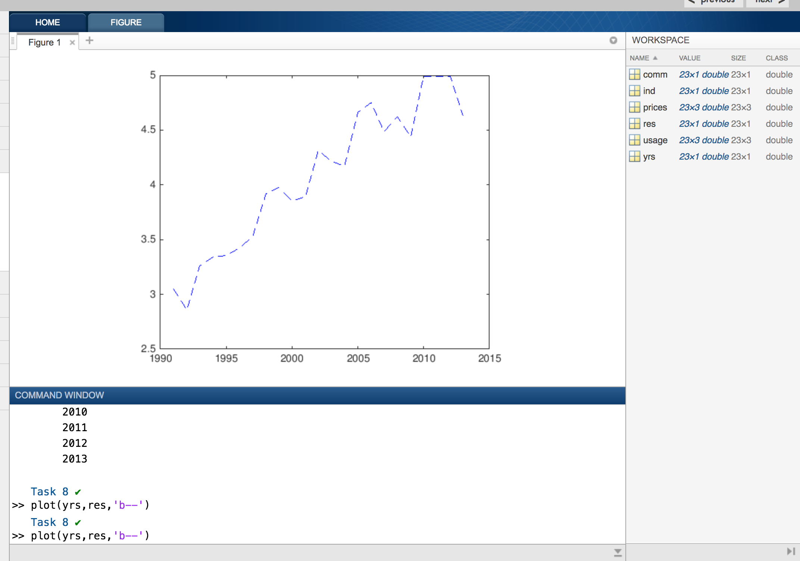

# MATLAB
MATLAB Tutorial

This tutorial is for beginners who wants to learn MATLAB. Let's begin with commands.

#### Course Contents

This course describes about the following topics.

1. Course Overview
  Familiarize yourself with the course.
    - Course Overview
2. Commands
  Enter commands in MATLAB to perform calculations and create variables.
    - Entering Commands
    - Storing Data in Variables
    - Using Built-in Functions and Constants
    - Desktop Overview
3. Vectors and Matrices
  Create MATLAB variables that contain multiple elements.
    - Manually Entering Arrays
    - Creating Evenly-Spaced Vectors
    - Array Creation Functions
4. Importing Data
  Bring data from external files into MATLAB.
    - Saving and Loading Variables
    - Import Tool
5. Indexing into and Modifying Arrays
  Use indexing to extract and modify rows, columns, and elements of MATLAB arrays.
    - Indexing into Arrays
    - Extracting Multiple Elements
    - Changing Values in Arrays
6. Array Calculations
  Perform calculations on entire arrays at once.
    - Performing Array Operations on Vectors
7. Calling Functions
  Call functions to obtain multiple outputs.
    - Obtaining Multiple Outputs from Function Calls
8. Obtaining Help
  Use the MATLAB documentation to discover information about MATLAB features.
    - Obtaining Help
9. Plotting Data
  Visualize variables using MATLAB's plotting functions.
    - Plotting Vectors
    - Annotating Plots
    - Plots Tab
10. Review Problems
  Bring together concepts that you have learned with a project.
    - Project - Electricity Usage
    - Project - Audio Frequency
11. MATLAB Scripts
  Write and save your own MATLAB programs.
    - The MATLAB Editor
12. Logical Arrays
  Use logical expressions to help you to extract elements of interest from MATLAB arrays.
    - Logical Operations and Variables
    - Combining Logical Conditions
    - Logical Indexing
13. Programming
  Write programs that execute code based upon some condition.
    - Decision Branching
    - For Loops
14. Final Project
  Bring together concepts that you have learned with a project.
    - Project - Stellar Motion
    - Project - Stellar Motion (Script)

### What is MATLAB ..?
MATLAB (matrix laboratory) is a multi-paradigm numerical computing environment and proprietary programming language developed by MathWorks. ... Although MATLAB is intended primarily for numerical computing,

#### Download & Installation:

Download the latest MATLAB from [Download MATLAB](https://in.mathworks.com/downloads/web_downloads) and install it as per your operating system. To get free trail for limited days, please register with your email in MATLAB website.

### Course Overview

This explains about MATLAB.

### Entering Commands

- You can execute commands by entering them in the command window after the MATLAB prompt (>>) and pressing the Enter key.
- Unless otherwise specified, MATLAB stores calculations in a variable named **ans**.
- The equals sign (=) in MATLAB is the assignment operator, meaning that the expression on the right of the equals sign is assigned to the variable on the left. So, when you enter x = 3+4, MATLAB first evaluates 3+4 and then assigns the result (7) to the variable x.
- Notice that the Workspace window (on the right) shows all the variables currently in the workspace.
- Adding a semicolon to the end of a command will suppress the output, though the command will still be executed, as you can see in the Workspace. When you enter a command without a semicolon at the end, MATLAB displays the result in the command window.
- You can recall previous commands by pressing the Up arrow key on your keyboard. Note that the Command Window must be the active window for this to work.
- When you enter just a variable name at the command prompt, MATLAB returns the current value of that variable.

##### Storing Data in Variables
- You can name your MATLAB variables anything you'd like as long as they start with a letter and contain only letters, numbers, and underscores **_**.

        3sq = 9
          ↑
        Error: Invalid expression. Check for missing multiplication operator, missing or unbalanced delimiters, or other      
        syntax error. To construct matrices, use brackets instead of parentheses.

        Did you mean: sq = 9 ?

- Try clearing all variables by entering the command **clear**
- **clear** command removes workspace variables, and **clc** clears the Command Window.

##### Using Built-in Functions and Constants
- Info: MATLAB contains built-in constants, such as pi to represent π.
      a = pi
      a =
      3.1416

Also, although only four decimal places are shown for π, it is represented internally with greater precision.
      x = pi/2
      1.5708

- MATLAB contains a wide variety of built-in functions, such as abs (absolute value) and eig (calculate eigenvalues).

      a = sin(-5)
      a =
      0.9589

      another example
      x = sin(10)

Note that MATLAB uses parentheses to pass inputs to functions, similar to standard mathematical notation.

- Now try using the **sqrt** function to calculate the square root of -9. Assign the result to a variable named z.

      z = sqrt(-9)
      z=
      0.0000 + 3.0000i

- Note that the solution contains the imaginary number, i, which is a built-in constant in MATLAB.

You can now move to the next section, or, if you are interested, explore a sampling of some of the other built-in functions in MATLAB (linked below).
      [Elementary math](http://www.mathworks.com/help/matlab/elementary-math.html)
      [Descriptive statistics](http://www.mathworks.com/help/matlab/descriptive-statistics.html)
      [Linear algebra](http://www.mathworks.com/help/matlab/linear-algebra.html)

### Vectors and Matrices

#### Manually Entering Arrays

- All MATLAB variables are arrays, meaning that each variable can contain multiple elements. A single number, called a scalar, is actually a 1-by-1 array, meaning it contains 1 row and 1 column.

Create a variable named x with a value of 4.

      x=4
      x=
      4
- You can create arrays with multiple elements using square brackets.

      >> x = [3 5]
      x =
          3    5

Create an array named x with two elements in a single row: 7 and 9

      >> x = [7 9]
      x =
      7 9

- When you separate numbers by spaces (or commas), MATLAB combines the numbers into a row vector, which is an array with one row and multiple columns (1-by-n). When you separate them by semicolons, MATLAB creates a column vector (n-by-1)

      >> x = [1;3].

Now create an array named x with two elements, 7 and 9, in a single column. Try recalling the previous command and changing the space between the numbers to a semicolon (;).

      >> x [7;9]
      x =
       7
       9

- Now try creating a 1-by-3 row vector named x that contains the values 3, 10, and 5 in that order.

       >> x = [3 10 5]
        x =
        3  10  5

- Now try creating a 3-by-1 column vector named x that contains the values 8, 2, and -4 in that order.

        >> x = [8;2;-4]
        x =
          8
          2
          -4

- You can combine spaces and semicolons to create matrices, which are arrays with multiple rows and columns. When entering matrices, you must enter them row by row.

        >> x = [3 4 5;6 7 8]
        x =
            3    4    5
            6    7    8

Try creating a matrix named x with the values shown below.

            5    6    7
            8    9   10

          >>x = [5 6 7;8 9 10]
          x =
            5    6    7
            8    9   10

- In MATLAB, you can perform calculations within the square brackets.

        >> x = [abs(-4) 4^2]
        x =
             4    16

Try creating a 1-by-2 row vector named x that contains **sqrt(10)** as its first element and **pi^2 (π2)** as its second element.

        >> x = [sqrt(10) pi^2]
          x =
          3.1623 9.8696

#### Creating Evenly-Spaced Vectors

- It is common to create vectors containing evenly spaced numbers, such as the vector below.

        >> y = [5 6 7 8]
        y =
            5    6    7    8

Try creating a row vector named x that contains the values 1, 2, and 3, in that order.

        >> x = [1 2 3]
          x =
          1  2  3

- For long vectors, entering individual numbers is not practical. An alternative, shorthand method for creating evenly spaced vectors is to use the **:** operator and specify only the start and end points: **first:last**.

        >> y = 5:8
        y =
            5    6    7    8

Try recreating the row vector named x (still with values 1, 2, and 3), but this time using the : operator.

       >> x = 1:3
       x =
          1  2  3

- The **:** operator uses a default spacing of 1, however you can specify your own spacing, as shown below.

      >> x = 20:2:26
      x =
          20    22    24    26

Try creating a row vector named x that starts at 1, ends at 5, and each element is separated by 0.5.

      >> x = 1:0.5:5
      x =
      1.0000  1.5000  2.0000  2.5000  3.0000  3.5000  4.0000  4.5000  5.0000

An Another Example

      >> x = 3:2:13
      x =
      3 5 7 9 11 13

- If you know the number of elements you want in a vector (instead of the spacing between each element), you could instead use the linspace function: linspace(first,last,number_of_elements). Note the use of commas (,) to separate inputs to the linspace function.

      >> x = linspace(0,1,5)
      x =
          0    0.250    0.500    0.750    1.000

Try creating a row vector named x that starts at 1, ends at 10, and contains 5 elements.

      >> x = linspace(1,10,5)
      x =
           1.0000    3.2500    5.5000    7.7500   10.0000

- Both linspace and the : operator create row vectors. However, you can convert a row vector into a column vector using the transpose operator (').

      >> x = 1:3;
      >> x = x'
      x =
          1
          2
          3

Transpose x from a row vector to a column vector using the transpose operator.

      >> x =
           1.0000    3.2500    5.5000    7.7500   10.0000
      >> x = x'
      x =
        1.0000    
        3.2500    
        5.5000    
        7.7500   
        10.0000

- You can create column vectors in a single command by creating the row vector and transposing it all on one line. Note the use of parentheses here to specify the order of operations.

      >> x = (1:2:5)'
      x =
          1
          3
          5

In a single command, create a column vector named x that starts at 5, ends at 9 and has elements that are spaced by 2.

      >> x = (5:2:9)'
      x =
          5
          7
          9

#### Array Creation Functions

- MATLAB contains many functions that help you to create commonly used matrices, such as matrices of random numbers.

      >> x = rand(2)
      x =
          0.8147    0.1270
          0.9058    0.9134

Note that the 2 in the command rand(2) specifies that the output will be a 2-by-2 matrix of random numbers.
Try creating a variable named x that is a 5-by-5 matrix of random numbers.

      >> x = rand(5)
      x =
          0.8147    0.0975    0.1576    0.1419    0.6557
          0.9058    0.2785    0.9706    0.4218    0.0357
          0.1270    0.5469    0.9572    0.9157    0.8491
          0.9134    0.9575    0.4854    0.7922    0.9340
          0.6324    0.9649    0.8003    0.9595    0.6787

- Many matrix creation functions allow you to input one number to create a square matrix (n-by-n) or input two numbers to create nonsquare matrices.
      >> x = rand(2)
      x =
          0.8147    0.1270
          0.9058    0.9134    >> x = rand(2,3)
      x =
          0.6324    0.2785    0.9575
          0.0975    0.5469    0.9649

Try using rand to create an array that contains 5 rows and 1 column. Assign the result to a variable named x.

      >>x = rand(5,1)
      x =
          0.7577
          0.7431
          0.3922
          0.6555
          0.1712

- Now try using the zeros function to create a matrix of all zeros that has 6 rows and 3 columns (6-by-3). Assign the result to a variable named x.

      >> x = zeros(6,3)
      x =
           0     0     0
           0     0     0
           0     0     0
           0     0     0
           0     0     0
           0     0     0

### 4. Importing Data

#### 4.1 Saving and Loading Variables

-You can save variables in your workspace to a MATLAB specific file format called a MAT-file using the save command.

      >> save foo x

The command above saves a variable named **x** to a MAT-file named **foo.mat**.
Try saving the workspace variable **data** to a file named **datafile.mat**

      >> save  datafile data

- Now, use **clear** to empty the workspace.

      >> clear

- You can load variables from a MAT-file using the load command.

      >> load foo

Try loading the variables from the file datafile.mat.

      >> load  datafile

#### 4.2 Import Tool

- You can import the text file, image data, spreadsheet in to MATLAB.
Once you import the file, the data of the file will be saved to a variable of that file name.

You can refer to the image here.

The text file with name elements.txt is imported as singular matrix. So, you can see the variable named as **elements** in workspace.

If any empty data will be replaces as NaN -> not a number

### 5. Indexing into and Modifying Arrays

#### 5.1 Indexing into Arrays

- You can extract values from an array using row, column indexing.

      >> x = A(5,7);

This syntax extracts the value in the 5th row and 7th column of A and assigns the result to the variable x.

The **data** variable contains the following content.

      >> data
      data =
          3.0000    0.5300    4.0753       NaN
         18.0000    1.7800    6.6678    2.1328
         19.0000    0.8600    1.5177    3.6852
         20.0000    1.6000    3.6375    8.5389
         21.0000    3.0000    4.7243   10.1570
         23.0000    6.1100    9.0698    2.8739
         38.0000    2.5400    5.3002    4.4508

Now, Try creating a variable v that contains the value in the 6th row and 3rd column of the variable **data**.

      >> v= data(6,3)
      v =
      9.0698

- You can use the MATLAB keyword end as either a row or column index to reference the last element.

      >> x = A(end,2);

Now try using the end keyword to obtain the value in the last row and 3rd column of the variable data. Assign this value to a variable named v.

      >> v = data(end,3);
      v =
          5.3002

- Note that you can use arithmetic with the keyword end. For example:

      >> x = A(end-1,end-2)

Try creating a scalar variable p that contains the value in the second to last (end-1) row and 3rd column of data.

      >> p = data(end-1,3)
      p =
          9.0698

#### 5.2 Extracting Multiple Elements

- When used as an index, the colon operator (:) specifies all the elements in that dimension. The syntax

      >> x = A(2,:)

creates a row vector containing all of the elements from the second row of A.
Try creating a variable named density that contains the second column of the matrix named data.

      >> density = data(:,2)
      density =
          0.5300
          1.7800
          0.8600
          1.6000
          3.0000
          6.1100
          2.5400

- The colon operator can refer to a range of values. The following syntax creates a matrix containing the first, second, and third rows of the matrix A.

      >> x = A(1:3,:)

Try creating a variable **volumes** containing the last two columns of data.

      >> volumes = data(:,3:4)
      volumes =
          4.0753       NaN
          6.6678    2.1328
          1.5177    3.6852
          3.6375    8.5389
          4.7243   10.1570
          9.0698    2.8739
          5.3002    4.4508

- A single index value can be used to reference vector elements. For example

      >> x = v(3)

returns the third element of vector v when v is either a row or column vector.
Using a single index value, create a variable named p containing the 6th element in the vector density.

      >> p = density(6)
      p =
          6.1100

- A single range of index values can be used to reference a subset of vector elements. For example

      >> x = v(3:end)

returns a subset of vector v containing the elements from 3 to the end.
Using a range of index values, create a vector named p containing the 2nd through 5th elements of density.

      >> p = density(2:5)
      p =
          1.7800
          0.8600
          1.6000
          3.0000

#### 5.3 Changing Values in Arrays

- Remember you can use the : character to extract entire columns of data.
Create a vector named v2 containing the last column of data.

      >> v2= data(:,end)
      v2 =
             NaN
          2.1328
          3.6852
          8.5389
         10.1570
          2.8739
          4.4508

- Elements of a variable can be altered by combining indexing with assignment.

        A(2,5) = 11

Try changing the first element in v2 from NaN to 0.5.

        >> v2(1) = 0.5
        v2 =
            0.5000
            2.1328
            3.6852
            8.5389
           10.1570
            2.8739
            4.4508

- Now, try changing the value in the first row and last column of data to 0.5.

      >> data(1,end) = 0.5
      data =
          3.0000    0.5300    4.0753    0.5000
         18.0000    1.7800    6.6678    2.1328
         19.0000    0.8600    1.5177    3.6852
         20.0000    1.6000    3.6375    8.5389
         21.0000    3.0000    4.7243   10.1570
         23.0000    6.1100    9.0698    2.8739
         38.0000    2.5400    5.3002    4.4508

### 6. Array Calculations

#### 6.1 Performing Array Operations on Vectors

- MATLAB is designed to work naturally with arrays. For example, you can add a scalar value to all the elements of an array.

        >> y = x + 2

Try adding 1 to each element of v1 and store the result in a variable named r.

        >> r = v1+1\
        r =
            5.0753
            7.6678
            2.5177
            4.6375
            5.7243
           10.0698
            6.3002

- You can add together any two arrays of the same size.

        >> z = x + y

Try creating a vector vs that is the sum of the vectors v1 and v2.

        >> vs = v1+ v2
        vs =
            4.5753
            8.8006
            5.2029
           12.1764
           14.8813
           11.9437
            9.7510

- You can multiply or divide all of the elements of an array by a scalar.

        >> z = 2*x
        >> y = x/3

Try creating a variable **va** that contains the value vs divided by 2 (the average volume).

        >> va = vs/2
        va =
            2.2877
            4.4003
            2.6014
            6.0882
            7.4406
            5.9718
            4.8755

- Basic statistical functions in MATLAB can be applied to a vector to produce a single output. The maximum value of a vector can be determined using the max function.

        >> xMax = max(x)

Try creating a variable vm containing the maximum of the va vector.

        >> vm =  max(va)
        vm =
            7.4406

- MATLAB has functions that perform mathematical operations on an entire vector or array of values in a single command.

        >> xSqrt = sqrt(x)

Using the round function, create a variable named vr which contains the rounded average volumes, va.

        >> vr = round(va)
        vr =
             2
             4
             3
             6
             7
             6
             5

- The * operator performs matrix multiplication. So, if you use * to multiply two equally sized vectors, since the inner dimensions do not agree, you will get an error message.

        >> z = [3 4] * [10 20]
        Error using  *
        Inner matrix dimensions must agree.

In contrast, the **.*** operator performs elementwise multiplication and allows you to multiply the corresponding elements of two equally sized arrays.

        >> z = [3 4] .* [10 20]
        z =
            30    80

Try to create a variable named mass containing the elementwise product of density and va.

        >> mass = density .* va
        mass =
            1.2125
            7.8325
            2.2372
            9.7411
           22.3220
           36.4880
           12.3838

### 7. Calling Functions

#### 7.1 Obtaining Multiple Outputs from Function Calls

- The size function can be applied to an array to produce a single output variable containing the array size.

        >> s = size(x)

Try creating a variable named **dsize** containing the size of the data variable.

        >> dsize = size(data)
        dsize =
             7     4

- The size function can be applied to a matrix to produce either a single output variable or two output variables. Use square brackets ([ ]) to obtain more than one output.

        >> [xrow,xcol] = size(x)

Try creating the variables dr and dc which respectively contain the number of rows and columns of the variable data.

        >> [dr,dc] = size(data)
        dr =
             7
        dc =
             4

- The maximum value of a vector and its corresponding index value can be determined using the max function. The first output from the max function is the maximum value of the input vector. When called with two outputs, the second output is the index value.

        >> [xMax,idx] = max(x)

Try creating the variables vMax and ivMax containing the maximum value of the v2 vector and the corresponding index value respectively.

        >> [vMax,ivMax] = max(v2)
        vMax =
           10.1570
        ivMax =
             5

### 8. Obtaining Help

#### 8.1 Obtaining Help:  (1/2) Using MATLAB's Documentation

- You can get help for all the functions and commands from MATLAB documentation page.

#### 8.1 Obtaining Help:  (2/2) Practice

- You can enter below command to get information on any MATLAB function.

        >> doc fcnName

Enter the command doc randi to open the documentation page for the randi function. This will open the documentation page in a new browser tab.

        >> doc randi

Refer to below image how this command works.

- The MATLAB documentation contains a lot of good examples and information that can help you when working on your own problems.
Use the documentation for randi to help complete the task below.

Create a matrix named x that
    - Contains random integers in the range from 1 to 20
    - Has 5 rows
    - Has 7 columns

        >> x = randi([1,20],5,7)
        x =
            14     5     5     2     1     1    18
             3     1    15    18    20    18    19
            20     8     8    20     7    14     1
            10     5     4    19    15    16     2
            18    17    15     9     8    12     5

### 9. Plotting Data

#### 9.1 Plotting Vectors

- Two vectors of the same length can be plotted against each other using the plot function.

        >> plot(x,y)

Try creating a plot with sample on the x-axis and mass1 on the y-axis.

        >> plot(sample,mass1)  This outputs the below plot.

- The plot function accepts an additional argument that allows you to specify the color, line style, and marker style using different symbols in single quotes.

        >> plot(x,y,'r--o')

The command above plots a red (r) dashed (--) line with a circle (o) as a marker. You can learn more about the symbols available in the documentation for [Line Specification](https://in.mathworks.com/help/matlab/ref/linespec.html).
Try plotting mass2 (y-axis) against sample (x-axis). Use red (r) star (*) markers and no line in your plot.

        >> plot(sample, mass2,'r*') This outputs the below plot.

- Notice that the first plot you created no longer exists. To plot one line on top of another, use the **hold on** command to hold the previous plot while you add another line. You can also use the **hold off** command to return to the default behavior.
Issue the **hold on** command.

- Now, plot mass1 (y-axis) against sample (x-axis) with black (k) square (s) markers and no line. [Line specification options](http://www.mathworks.com/help/matlab/ref/linespec.html)

        >> plot(sample,mass1,'ks') This outputs the below plot.
]

- Try closing all open figure windows by issuing the close all command.

        >> close all

- When you plot a single vector by itself, MATLAB uses the vector values as the y-axis data and sets the x-axis data to range from 1 to n (the number of elements in the vector).
Plot the vector v1 using the command below.

        >> plot(v1)
        This outputs the following plot

- The plot function accepts optional additional inputs consisting of a property name and an associated value.

        >> plot(y,'LineWidth',5)

The command above plots a heavy line. You can learn more about available properties in the documentation for Lineseries Properties. Now try plotting v1 with a line width of 3.

        >> plot(v1,'LineWidth',3)
        This outputs the following plot

- The plot function accepts a property name and property value pair after the plotted arguments and line specifier.

        >> plot(x,y,'ro-','LineWidth',5)

Try plotting v1 (y-axis) against sample (x-axis) with red (r) circle (o) markers with a line width of 4.

        >> plot(sample,v1,'ro','LineWidth',4)
        This outputs the following plot

Further resources:
- [Line Specifiers](http://www.mathworks.com/help/matlab/ref/linespec.html)
- [Plotting Functions](http://www.mathworks.com/help/matlab/creating_plots/using-high-level-plotting-functions.html)
- [Plots](http://www.mathworks.com/help/matlab/learn_matlab/plots.html)

#### 9.2 Annotating Plots

- Labels can be added to plots using plot annotation functions, such as title. The input to these functions is a string. Strings in MATLAB are enclosed in single quotes (').

        >> title('Plot Title')

Try adding the title 'Sample Densities' to the existing plot.

        >> title('Sample Densities')

- Use the ylabel function to add the label 'Density (g/cm^3)'.

        >> ylabel('Density (g/cm^3)')

This outputs the following plot and observe plot title also in below image.
        

use **xlabel()** function to label the X axis.

        >> xlabel('Distance')

#### 9.3 Plots Tab

- Select the variables you want to plot and then go to plots tab and select the plot type you want to generate. That's all.
It generates the plot for selected variables.

### 10. Review Problems

#### 10.1 Project - Electricity Usage

- Electricity data is stored in a file named electricity.mat. Use load to bring that data into MATLAB.

      >> load electricity.mat

- Enter usage at the command prompt to see the values in usage.

      >> usage

-  In MATLAB, NaN (or, "Not a Number") is used to represent missing data.
One of the elements in the **usage** variable has a value of NaN. Replace this value with the value 2.74.

      >> usage
      usage =
          3.0484    2.5848    2.6408
          2.8610    2.5530    **NaN**
          3.2602    2.7084    2.7345
          3.3420    2.8097    2.8019
          3.3555    2.9167    2.7960
          3.4234    2.9299    2.8579
          3.5268    3.1561    2.8597
          3.9185    3.3057    2.8757
          3.9718    3.4761    2.9984
          3.8540    3.4748    2.8998
          3.8934    3.5968    2.6826
          4.3127    3.7088    2.8427
          4.2153    3.7172    2.8301
          4.1711    3.7257    2.8542
          4.6605    3.9367    2.8512
          4.7528    4.0497    2.8671
          4.4847    3.9975    2.8715
          4.6216    4.1299    2.8487
          4.4413    3.9229    2.5176
          4.9899    4.1266    2.7653
          4.9913    4.1311    2.8143
          4.9864    4.1463    2.8135
          4.6270    4.1205    2.7001

Replacing NaN with given value. The position of NaN is 2nd row and 3rd column.

    >> usage(2,3) = 2.74

- The residential data is stored in the first column. Create a variable **res** that contains the first column of **usage**.

      >> res = usage(;,1)
      res =
          3.0484
          2.8610
          3.2602
          3.3420
          3.3555
          3.4234
          3.5268
          3.9185
          3.9718
          3.8540
          3.8934
          4.3127
          4.2153
          4.1711
          4.6605
          4.7528
          4.4847
          4.6216
          4.4413
          4.9899
          4.9913
          4.9864
          4.6270

- The commercial data is stored in the second column. Create a variable **comm** that contains the second column of **usage**.

          >> comm = usage(:,2)
          comm =
              2.5848
              2.5530
              2.7084
              2.8097
              2.9167
              2.9299
              3.1561
              3.3057
              3.4761
              3.4748
              3.5968
              3.7088
              3.7172
              3.7257
              3.9367
              4.0497
              3.9975
              4.1299
              3.9229
              4.1266
              4.1311
              4.1463
              4.1205

- The industrial data is stored in the third column. Create a variable ind that contains the third column of usage.

            >> ind = usage(:,3)
            ind =
                2.6408
                2.7400
                2.7345
                2.8019
                2.7960
                2.8579
                2.8597
                2.8757
                2.9984
                2.8998
                2.6826
                2.8427
                2.8301
                2.8542
                2.8512
                2.8671
                2.8715
                2.8487
                2.5176
                2.7653
                2.8143
                2.8135
                2.7001

- The usage data was collected annually between the years 1991 to 2013. The **yrs** variable you create will help you to plot the data over a meaningful range.
Create a column vector named **yrs** that represents the years starting at 1991 and ending with 2013.

              >> yrs = (1991:2013)'
              yrs =
                      1991
                      1992
                      1993
                      1994
                      1995
                      1996
                      1997
                      1998
                      1999
                      2000
                      2001
                      2002
                      2003
                      2004
                      2005
                      2006
                      2007
                      2008
                      2009
                      2010
                      2011
                      2012
                      2013

- Plot **res** (y-axis) against **yrs** (x-axis) with a blue (b) dashed line (--).

          >> plot(yrs, res, 'b--')

This generates the below plot.

- Issue the **hold on** command so that you can add another line to the existing plot.

          >> hold on

- Plot **comm** (y-axis) against **yrs** (x-axis) with a black (k) dotted line (**:**).

        >> plot(yrs, comm, 'k:')

This generates the below plot.

- Plot **ind** (y-axis) against **yrs** (x-axis) with a magenta (m) dash-dot line (**-.**).

        >> plot(yrs, ind, 'm-.')

This generates the below plot

- Add the title 'July Electricity Usage' to the existing plot.

        >> title('July Electricity Usage')

- Use the legend function to specify a legend.

        >> legend('a','b','c')

Add the legend values 'res', 'comm', and 'ind' to the existing plot.

        >> legend('res', 'comm', 'ind')

The above title and legend commands does the following effect to plot. See the plot below.

- Complete! When looking at the figure, it is clear that the industrial sector's electricity usage is fairly consistent and does not seem to fluctuate as much as the residential and commercial sectors.

#### 10.2 Project - Audio Frequency

- Info: **fs** will represent the sampling frequency of the audio signal.
First, create a variable named **fs** that contains the value 10

        >>fs = 10
        fs =
            10

- **t** will represent the times when the audio signal was sampled. Remember you can use a semicolon (;) to suppress the output of a command to prevent cluttering the Command Window.

Create a vector named t that starts at 0, ends at 20, and whose elements are spaced by 1/fs

          >> t = 0:1/fs:20
          t =
            Columns 1 through 18
                   0    0.1000    0.2000    0.3000    0.4000    0.5000    0.6000    0.7000    0.8000    0.9000    1.0000    1.1000    1.2000    1.3000    1.4000    1.5000    1.6000    1.7000
            Columns 19 through 36
              1.8000    1.9000    2.0000    2.1000    2.2000    2.3000    2.4000    2.5000    2.6000    2.7000    2.8000    2.9000    3.0000    3.1000    3.2000    3.3000    3.4000    3.5000
            Columns 37 through 54
              3.6000    3.7000    3.8000    3.9000    4.0000    4.1000    4.2000    4.3000    4.4000    4.5000    4.6000    4.7000    4.8000    4.9000    5.0000    5.1000    5.2000    5.3000
            Columns 55 through 72
              5.4000    5.5000    5.6000    5.7000    5.8000    5.9000    6.0000    6.1000    6.2000    6.3000    6.4000    6.5000    6.6000    6.7000    6.8000    6.9000    7.0000    7.1000
            Columns 73 through 90
              7.2000    7.3000    7.4000    7.5000    7.6000    7.7000    7.8000    7.9000    8.0000    8.1000    8.2000    8.3000    8.4000    8.5000    8.6000    8.7000    8.8000    8.9000
            Columns 91 through 108
              9.0000    9.1000    9.2000    9.3000    9.4000    9.5000    9.6000    9.7000    9.8000    9.9000   10.0000   10.1000   10.2000   10.3000   10.4000   10.5000   10.6000   10.7000
            Columns 109 through 126
             10.8000   10.9000   11.0000   11.1000   11.2000   11.3000   11.4000   11.5000   11.6000   11.7000   11.8000   11.9000   12.0000   12.1000   12.2000   12.3000   12.4000   12.5000
            Columns 127 through 144
             12.6000   12.7000   12.8000   12.9000   13.0000   13.1000   13.2000   13.3000   13.4000   13.5000   13.6000   13.7000   13.8000   13.9000   14.0000   14.1000   14.2000   14.3000
            Columns 145 through 162
             14.4000   14.5000   14.6000   14.7000   14.8000   14.9000   15.0000   15.1000   15.2000   15.3000   15.4000   15.5000   15.6000   15.7000   15.8000   15.9000   16.0000   16.1000
            Columns 163 through 180
             16.2000   16.3000   16.4000   16.5000   16.6000   16.7000   16.8000   16.9000   17.0000   17.1000   17.2000   17.3000   17.4000   17.5000   17.6000   17.7000   17.8000   17.9000
            Columns 181 through 198
             18.0000   18.1000   18.2000   18.3000   18.4000   18.5000   18.6000   18.7000   18.8000   18.9000   19.0000   19.1000   19.2000   19.3000   19.4000   19.5000   19.6000   19.7000
            Columns 199 through 201
             19.8000   19.9000   20.0000

- **y** will represent the audio signal amplitude at each sampled time.
Create a variable named y that contains the sum of two sine waves: sin(1.8*2πt) + sin(2.1*2πt)

    >> y = sin((1.8) * (2 * pi * t)) + sin( (2.1) * (2 * pi * t))
    y =
      Columns 1 through 18

             0    1.8734    1.2523   -0.9777   -1.8266   -0.2788    1.4798    1.1854   -0.5367   -1.3220   -0.3633    0.8044    0.7190   -0.1478   -0.4935   -0.1420    0.0860   -0.0577

      Columns 19 through 36

        0.0157    0.4190    0.3633   -0.4465   -0.9332   -0.1058    1.1535    1.0000   -0.6561   -1.6468   -0.4359    1.5181    1.5388   -0.5445   -1.9803   -0.7939    1.4551    1.7601

      Columns 37 through 54

       -0.2428   -1.8364   -0.9697    1.0551    1.5388    0.0471   -1.2730   -0.8106    0.5163    0.8968    0.1380   -0.4803   -0.2888    0.0638   -0.0000   -0.0638    0.2888    0.4803

      Columns 55 through 72

       -0.1380   -0.8968   -0.5163    0.8106    1.2730   -0.0471   -1.5388   -1.0551    0.9697    1.8364    0.2428   -1.7601   -1.4551    0.7939    1.9803    0.5445   -1.5388   -1.5181

      Columns 73 through 90

        0.4359    1.6468    0.6561   -1.0000   -1.1535    0.1058    0.9332    0.4465   -0.3633   -0.4190   -0.0157    0.0577   -0.0860    0.1420    0.4935    0.1478   -0.7190   -0.8044

      Columns 91 through 108

        0.3633    1.3220    0.5367   -1.1854   -1.4798    0.2788    1.8266    0.9777   -1.2523   -1.8734   -0.0000    1.8734    1.2523   -0.9777   -1.8266   -0.2788    1.4798    1.1854

      Columns 109 through 126

       -0.5367   -1.3220   -0.3633    0.8044    0.7190   -0.1478   -0.4935   -0.1420    0.0860   -0.0577    0.0157    0.4190    0.3633   -0.4465   -0.9332   -0.1058    1.1535    1.0000

      Columns 127 through 144

       -0.6561   -1.6468   -0.4359    1.5181    1.5388   -0.5445   -1.9803   -0.7939    1.4551    1.7601   -0.2428   -1.8364   -0.9697    1.0551    1.5388    0.0471   -1.2730   -0.8106

      Columns 145 through 162

        0.5163    0.8968    0.1380   -0.4803   -0.2888    0.0638    0.0000   -0.0638    0.2888    0.4803   -0.1380   -0.8968   -0.5163    0.8106    1.2730   -0.0471   -1.5388   -1.0551

      Columns 163 through 180

        0.9697    1.8364    0.2428   -1.7601   -1.4551    0.7939    1.9803    0.5445   -1.5388   -1.5181    0.4359    1.6468    0.6561   -1.0000   -1.1535    0.1058    0.9332    0.4465

      Columns 181 through 198

       -0.3633   -0.4190   -0.0157    0.0577   -0.0860    0.1420    0.4935    0.1478   -0.7190   -0.8044    0.3633    1.3220    0.5367   -1.1854   -1.4798    0.2788    1.8266    0.9777

      Columns 199 through 201

       -1.2523   -1.8734   -0.0000
